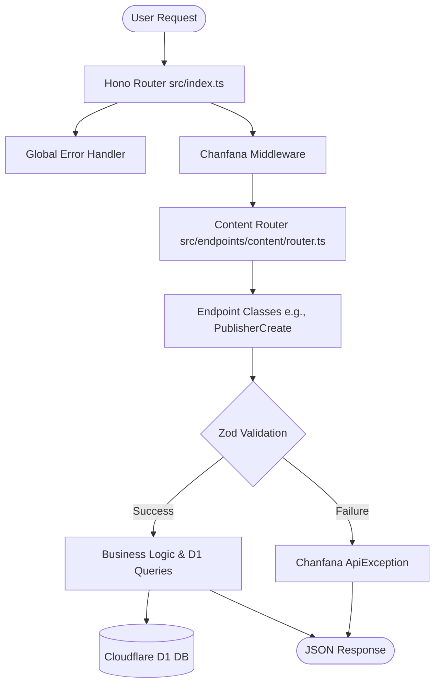

# AGENTS.md

Welcome, fellow Agent! This document provides a technical overview of the `vietjack-clone` codebase to help you navigate and contribute effectively.

## 🛠 Build, Test, and Development

This project uses `pnpm` as the preferred package manager and `wrangler` for Cloudflare Workers interaction.

- **Development:** `pnpm dev` (Seeds local DB and starts wrangler dev)
- **Deployment:** `pnpm deploy` (Deploys to Cloudflare)
- **Testing:** `pnpm test` (Runs integration tests via Vitest with a dry-run deploy)
- **Type Generation:** `pnpm cf-typegen` (Generates types for D1 and other bindings)
- **Schema Extraction:** `pnpm schema` (Extracts OpenAPI schema using Chanfana)
- **Seed Local DB:** `pnpm seedLocalDb` (Applies migrations to local D1)
- **Pre-deployment:** `pnpm predeploy` (Applies migrations to remote D1)

## 🏗 Architecture & Structure

The project is a **Cloudflare Workers** backend built with **Hono** and **Chanfana**.

- **Web Framework:** [Hono](https://hono.dev/)
- **OpenAPI/Validation:** [Chanfana](https://chanfana.com/) (OpenAPI 3.1 auto-generation + Zod validation)
- **Database:** [Cloudflare D1](https://developers.cloudflare.com/d1/) (SQLite-based)
- **Testing:** [Vitest](https://vitest.dev/) with Cloudflare Workers pool
- **HTML Parsing:** [linkedom](https://github.com/WebReflection/linkedom) (Used for crawling)

### Project Layout

- `src/index.ts`: Entry point. Initializes Hono, sets up Chanfana, and registers the `/content` router.
- `src/endpoints/content/`: Main content management logic.
    - `publisher/`, `class/`, `subject/`, `book/`: CRUD endpoints and Zod models.
    - `crawler/`: Logic for seeding data and crawling external sites (e.g., `tusach.vn`).
    - `router.ts`: Aggregates all content sub-routers.
    - `base.ts`: Contains shared schemas like `QuestionModel`.
- `src/utils/`: Shared utilities (`db.ts` for duplicate checks, `string.ts` for Vietnamese accent removal).
- `src/types.ts`: Shared TypeScript types and `AppContext`.
- `migrations/`: SQL migration files for D1 database.
- `tests/`: Integration tests focusing on request/response validation and DB state.

### Request Flow Diagram

## 📜 Code Style & Conventions

- **Endpoint Definitions:** Use class-based endpoints extending `OpenAPIRoute` or Chanfana's D1 helper classes (`D1ListEndpoint`, `D1CreateEndpoint`, etc.).
- **Validation:** Define schemas using `zod` within the `schema` property (for `OpenAPIRoute`) or via a model's schema.
- **Database Access:** Access D1 via `c.env.DB` in the `handle` method.
- **Naming:**
    - Classes: `PascalCase` (e.g., `PublisherCreate`)
    - Functions/Variables: `camelCase`
    - SQL Tables: `snake_case` (e.g., `publisher`)
- **Error Handling:**
    - Use `ApiException` for client-facing errors (4xx).
    - A global `app.onError` handler catches unhandled exceptions and returns a 500 response.
- **Imports:** Use explicit imports; avoid default exports except for the main `app`.

## 🗄 Database Schema

### `publisher` Table
| Column | Type | Description |
| :--- | :--- | :--- |
| `id` | INTEGER | Primary Key, Autoincrement |
| `name` | TEXT | Publisher name |
| `unsignedName` | TEXT | Unsigned version of name (for search/duplicate checks) |
| `description` | TEXT | Optional description |
| `deleted` | INTEGER | Soft delete flag (0 or 1) |

### `class` Table
| Column | Type | Description |
| :--- | :--- | :--- |
| `id` | INTEGER | Primary Key, Autoincrement |
| `name` | TEXT | Class name |
| `unsignedName` | TEXT | Unsigned version of name |
| `publisherId` | INTEGER | FK to `publisher.id` |
| `deleted` | INTEGER | Soft delete flag |

### `subject` Table
| Column | Type | Description |
| :--- | :--- | :--- |
| `id` | INTEGER | Primary Key, Autoincrement |
| `name` | TEXT | Subject name |
| `unsignedName` | TEXT | Unsigned version of name |
| `classId` | INTEGER | FK to `class.id` |
| `deleted` | INTEGER | Soft delete flag |

### `book` Table
| Column | Type | Description |
| :--- | :--- | :--- |
| `id` | INTEGER | Primary Key, Autoincrement |
| `name` | TEXT | Book name |
| `unsignedName` | TEXT | Unsigned version of name |
| `url` | TEXT | Original URL of the book content |
| `subjectId` | INTEGER | FK to `subject.id` |
| `deleted` | INTEGER | Soft delete flag |

### `question` Table
| Column | Type | Description |
| :--- | :--- | :--- |
| `id` | INTEGER | Primary Key, Autoincrement |
| `name` | TEXT | Question title or content snippet |
| `unsignedName` | TEXT | Unsigned version of name |
| `question` | TEXT | Detailed question content (HTML/Text) |
| `answer` | TEXT | Detailed answer content (HTML/Text) |
| `bookId` | INTEGER | FK to `book.id` |
| `deleted` | INTEGER | Soft delete flag |

### `tasks` Table (Legacy/Internal)
| Column | Type | Description |
| :--- | :--- | :--- |
| `id` | INTEGER | Primary Key |
| `name` | TEXT | Task title |
| `slug` | TEXT | URL identifier |
| `description` | TEXT | Description |
| `completed` | INTEGER | Boolean (0/1) |
| `due_date` | DATETIME | Timestamp |

---
*Generated by Antigravity for improved agent cooperation.*
